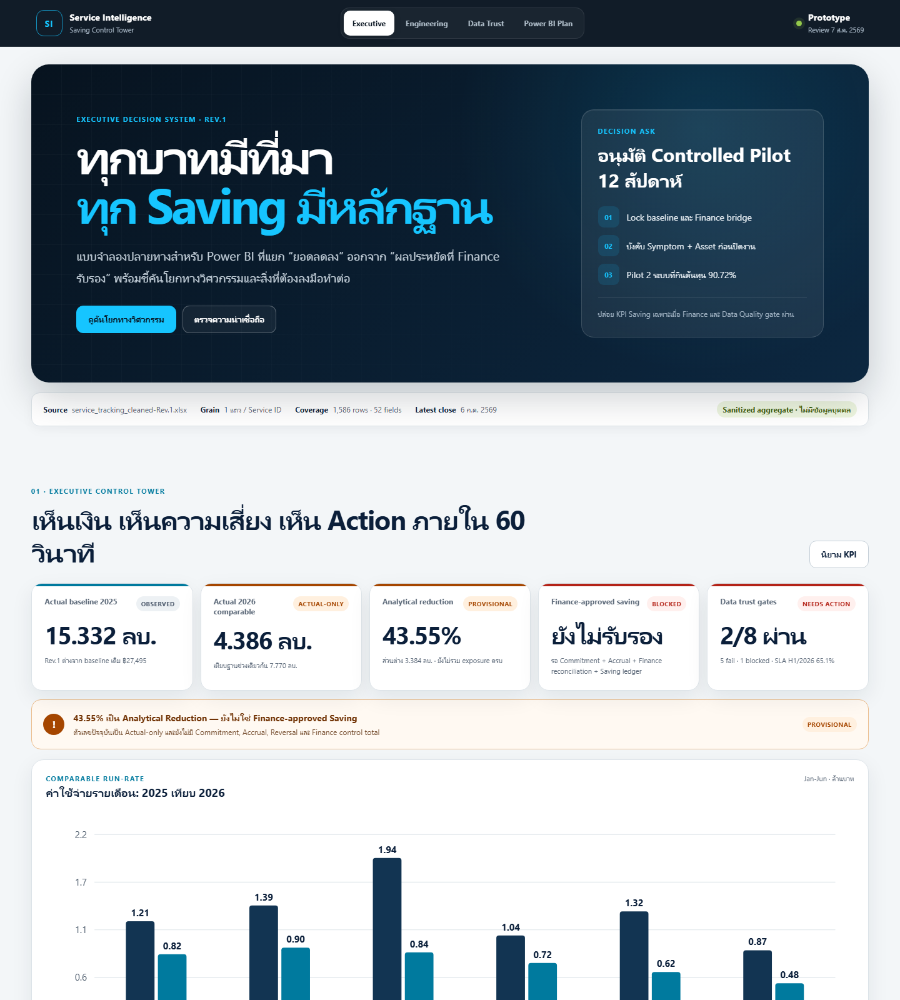

D:\OneDrive - PTTOR\PTTOR งานซ่อม ตลาดพาณิชย์ (ซฟ.2569)\__3.Transformation Service Tracking 22-6-69\__POWER-BI_Saving_Project

# Service Intelligence & Saving Control Tower

โครงการยกระดับข้อมูล Service Tracking ให้เป็นระบบตัดสินใจด้านงานซ่อมบำรุง ต้นทุน ความเสี่ยง และผลประหยัดสำหรับ Power BI โดยใช้ข้อมูล `service_tracking_cleaned-Rev.1.xlsx` เป็นฐานวิเคราะห์

> สถานะ Rev.1 ณ 7 สิงหาคม 2026: พร้อมใช้เป็น analytical prototype และ controlled pilot แต่ยังไม่ควรประกาศ “Saving ทางการเงิน” จนกว่า Finance จะอนุมัตินิยาม baseline, accrual และขอบเขตงานที่รวม/ไม่รวม

**Live demo:** [power-bi-saving-project.vercel.app](https://power-bi-saving-project.vercel.app)



## ผลลัพธ์สำคัญ

- วิเคราะห์ข้อมูลบริการ 1,586 รายการ มูลค่าที่บันทึก 19.85 ล้านบาท
- H1 2026 เทียบ H1 2025 ลดลงเชิงวิเคราะห์ 3.38 ล้านบาท หรือ 43.55%
- แยก Cost Bridge ด้วยตรรกะวิศวกรรมเป็น Volume effect -0.75 ล้านบาท, PM/CM mix +0.03 ล้านบาท และ Rate/Scope/Exposure effect -2.67 ล้านบาท
- SLA ปัจจุบัน 65.10% และข้อมูลอุปกรณ์ครอบคลุมเพียง 10.72% จึงยังวิเคราะห์ Bad Actor Asset หรือ MTBF อย่างน่าเชื่อถือไม่ได้
- ค่าใช้จ่าย 39.33% อยู่ในรายการที่ไม่มีอาการเสียที่มีความหมาย ซึ่งเป็นจุดปรับปรุงสำคัญของ data capture
- พบ baseline อย่างน้อย 3 นิยามที่ยังไม่ตรงกัน จึงออกแบบ Finance Gate เพื่อแยก “ผลต่างเชิงวิเคราะห์” ออกจาก “ผลประหยัดที่รับรองแล้ว”

ตัวเลขทั้งหมดในเว็บไซต์เป็นข้อมูลสรุปที่ผ่านการ sanitize ไม่มีชื่อสถานี ชื่อผู้ปฏิบัติงาน รายละเอียด Call หรือข้อมูลระดับรายการ

## สิ่งที่ส่งมอบ

- [Interactive dashboard mockup](index.html) — Executive, Engineering, Data Trust และ Power BI Plan
- [กลยุทธ์ Rev.1 และแผนดำเนินงานแบบเป็นเฟส](docs/08-rev1-strategy-and-roadmap.md)
- [Executive storytelling และ UX guide](docs/07-executive-storytelling-and-ux.md)
- [ผลตรวจคุณภาพข้อมูลแบบอิสระ](analysis/independent-data-quality-audit.md)
- [Power BI semantic model guide](powerbi/model-implementation-guide-v2.md)
- [DAX measures รุ่น Rev.1](powerbi/measures-v2.dax)
- [ข้อมูลสรุปสำหรับ dashboard](data/dashboard-data.json)
- [สคริปต์สร้าง analytical assets](tools/build_analytics_assets.py)
- [สคริปต์ตรวจสอบก่อนเผยแพร่](tools/validate_analytics_assets.py)

## Dashboard architecture เป้าหมาย

1. Executive Saving Control Tower
2. Cost & Workload Engineering
3. Root Cause / Pareto / Repeat Repair
4. Asset Reliability & Bad Actor
5. Vendor / SLA / Warranty
6. PM & Legal Compliance
7. Budget / Commitment / Forecast
8. Data Quality & Reconciliation
9. Repair History Drill-through

หลักคิดคือให้ทุก KPI ตอบได้สามชั้น: “เกิดอะไรขึ้น → เพราะอะไร → ต้องตัดสินใจอะไร” และให้ Cost Bridge reconcile กลับยอดรวมได้เสมอ

## แผนดำเนินงาน

- Phase 0 — Baseline & governance lock: ยืนยัน baseline, scope, accrual และเจ้าของข้อมูล
- Phase 1 — Data foundation: สร้าง star schema, Date/Asset/Vendor dimensions และ validation rules
- Phase 2 — Controlled pilot 12 สัปดาห์: ทดลองกับกลุ่มอาการ/ระบบที่มีมูลค่าสูงและวัดก่อน–หลัง
- Phase 3 — Power BI production: ทำ semantic model, RLS, refresh, reconciliation และ deployment pipeline
- Phase 4 — Scale & control: ขยาย use case, standard work, self-maintenance ภายใต้ safety boundary และ Finance sign-off

รายละเอียดเกณฑ์ผ่าน–ไม่ผ่าน เจ้าของงาน และสิ่งส่งมอบของแต่ละ phase อยู่ใน [Rev.1 strategy and roadmap](docs/08-rev1-strategy-and-roadmap.md)

## ใช้งานในเครื่อง

ต้องมี Python 3.10 ขึ้นไป และวางไฟล์ Excel ต้นฉบับไว้เฉพาะในเครื่องตามชื่อเดิม

```powershell
python tools/build_analytics_assets.py
python tools/validate_analytics_assets.py
python -m http.server 8000
```

จากนั้นเปิด `http://localhost:8000` สคริปต์ build ใช้ไฟล์ต้นฉบับเพื่อคำนวณ แต่เขียนออกเฉพาะ aggregate JSON ที่อนุญาตให้เผยแพร่

## Data protection

Repository นี้เป็น public package จึงห้าม commit ไฟล์ `.xlsx`, `.xls`, `.pbix`, `.pbit`, `.docx`, `.pdf` หรือข้อมูลระดับรายการ ระบบ CI จะหยุดทันทีเมื่อพบไฟล์ต้นฉบับหรือคีย์ข้อมูลอ่อนไหวใน payload สาธารณะ

ไฟล์ต้นฉบับควรอยู่ใน SharePoint/Teams ที่กำหนดสิทธิ์ ส่วน GitHub เก็บเฉพาะโค้ด นิยาม KPI เอกสาร วิธีตรวจสอบ และข้อมูลสรุปที่ผ่านการ sanitize แล้ว

## เอกสารเดิมที่ยังใช้อ้างอิง

- [Current-state assessment](docs/01-current-state-assessment.md)
- [Power BI blueprint รุ่นเดิม](docs/02-power-bi-blueprint.md)
- [Cost-reduction plan รุ่นเดิม](docs/03-cost-reduction-plan.md)
- [Self-maintenance safety boundary](docs/04-self-maintenance.md)
- [Implementation runbook](docs/05-implementation-runbook.md)
- [Infographic backlog](docs/06-infographic-backlog.md)
- [Data contract รุ่นเดิม](powerbi/data-contract.md)

## ข้อจำกัดการตีความ

ตัวเลข 43.55% เป็น actual-to-actual analytical variance ของ H1 ไม่ใช่ booked saving และอาจเปลี่ยนเมื่อรวม late invoice, commitment, accrual, งานตามกฎหมาย หรือปรับขอบเขตเทียบเคียงให้เหมือนกัน การนำเสนอผลอย่างเป็นทางการต้องผ่าน Finance Gate ตามเอกสาร Rev.1
