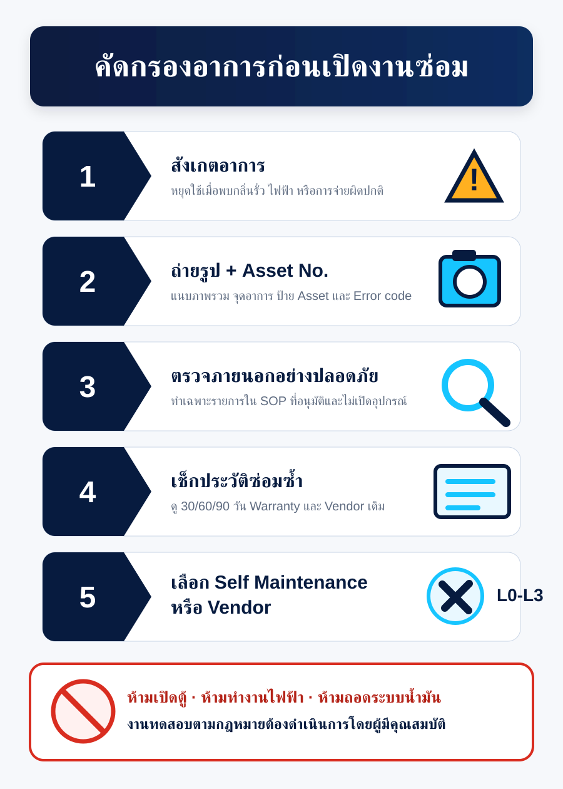

# Self Maintenance

Self Maintenance ในโครงการนี้หมายถึงการตรวจสอบและแก้ไขเบื้องต้นที่ปลอดภัย
ตาม SOP ที่อนุมัติ ไม่ใช่การโอนงานช่างหรือการทดสอบตามกฎหมายให้ผู้ใช้งานทั่วไป

## ระดับงาน

| ระดับ | ผู้ดำเนินการ | ทำได้ | ห้าม/ต้อง Escalate |
|---|---|---|---|
| L0 Observe | ผู้ใช้/สถานี | หยุดใช้, กั้นพื้นที่, ถ่ายรูป, Asset No., error code, ตรวจภายนอก | เปิดตู้, ไฟฟ้า, ถอดอุปกรณ์น้ำมัน |
| L1 Guided | ผู้ใช้ภายใต้ Remote SOP | Function check หรือ reset ที่ผู้ผลิตอนุมัติ | งานที่ไม่มี SOP/ความเสี่ยงไม่ชัด |
| L2 Technical | ช่าง/ผู้รับจ้างที่ผ่านคุณสมบัติ | ซ่อมภายใน, เปลี่ยนอะไหล่, electrical/fuel work ตามมาตรฐาน | งานทดสอบที่ต้องผู้มีคุณสมบัติเฉพาะ |
| L3 Statutory | ผู้ทดสอบ/ตรวจสอบตามกฎหมาย | ทดสอบ ตรวจสอบ ออกหลักฐาน | ห้ามลด Scope เพื่อประหยัด |

## Red flags: หยุดใช้งานและ Escalate ทันที

- พบกลิ่น/คราบ/หยดน้ำมัน หรือสงสัยการรั่ว
- มีประกายไฟ ควัน ความร้อนผิดปกติ หรือเบรกเกอร์ตัด
- ตู้จ่ายไม่หยุดจ่าย/มือจ่ายไม่ตัด
- ปริมาณจ่ายคลาดเคลื่อนหรือสงสัยมาตรวัด
- ATG/tank alarm ที่เกี่ยวกับ leak, high level หรือ communication loss
- อุปกรณ์นิรภัยชำรุด

## Workflow

1. Safety first: หยุดใช้และกั้นพื้นที่ตาม SOP
2. Capture: สถานที่, Asset No., เวลา, รูป/วิดีโอ, error code
3. Classify: PM หรือ CM และเลือก Symptom code
4. Search: งานซ้ำ 30/60/90 วัน, Warranty, Vendor เดิม
5. Decide: L0/L1/L2/L3 ตาม Decision matrix
6. Verify: Function test ตาม SOP
7. Record: Resolution, downtime, dispatch avoided, reopen

## KPI

- Triage completion rate
- Self-maintenance eligibility rate
- Safe self-resolution rate
- Avoided dispatch count
- Validated avoided dispatch cost
- Reopen within 7/30 days
- Escalation compliance
- Safety incident

## หลักการคิด Avoided cost

ไม่นับทุกงานที่ไม่ส่ง Vendor เป็น Saving ให้ใช้:

`Validated avoided cost = Approved standard dispatch cost - actual intervention cost`

ต้องหักค่าแรง/เวลา/วัสดุของ Self Maintenance และไม่นับหากงานกลับมาเปิดซ้ำ
ภายในช่วง Guardrail

ประกาศ/กฎหมายที่เกี่ยวข้องต้องตรวจสอบกับเจ้าของงาน HSE/กฎหมายก่อนออก SOP
ฉบับ Production โดยเริ่มค้นจาก [ฐานกฎหมายกรมธุรกิจพลังงาน](https://elaw.doeb.go.th/)
